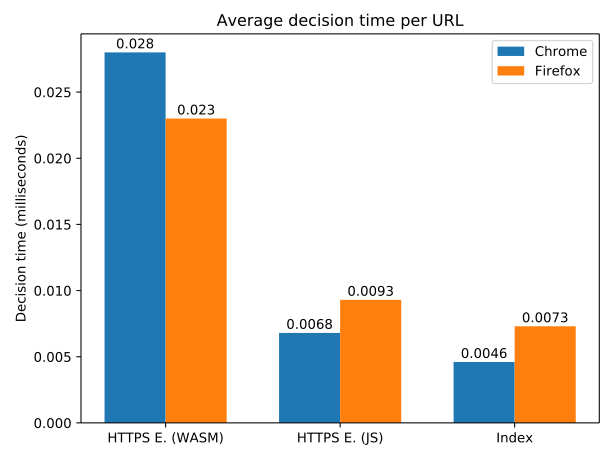

**TL;DR:** *In this post I describe the results of an experiment showing
how matching of HTTPS Everywhere rules can be made **between 4x and
10x more memory-efficient**, initialization of the matching engine
reduced to less than **25 milliseconds**, and HTTPS upgrades performed
in **0.0029** to **0.0073 milliseconds**, using a different design
inspired by modern adblockers, without relying on the Rust/WebAssembly
combo (i.e. pure JavaScript).*


**Disclaimer:** *This work was *not* conducted as part of the HTTPS
Everywhere project. My intent when experimenting with rulesets matching
was to explore new ways to implement an efficient engine and document
my findings. I would of course love it if some of these ideas are used
upstream.*

Over the last few years, the adoption of HTTPS has continuously increased,
reaching 50% of the Web traffic for the [first time in 2017](https://letsencrypt.org/stats/#percent-pageloads)
and up to [80% in 2019](https://almanac.httparchive.org/en/2019/security#transport-layer-security).
Yet, [according to the EFF](https://www.eff.org/https-everywhere):
*"Many sites on the web [still] offer some limited support for
encryption over HTTPS, but make it difficult to use. For instance, they
may default to unencrypted HTTP, or fill encrypted pages with links that
go back to the unencrypted site."*

For this reason, the EFF started the HTTPS Everywhere project in 2014,
providing users with a browser extension able to automatically upgrade
connections to HTTPS whenever possible.

To decide when an upgrade is feasible, the extension relies on a database of
*rulesets* allowing it to know for a given URL if HTTPS is supported. These
rules are [continuously updated](https://github.com/EFForg/https-everywhere/commits/master/src/chrome/content/rules)
to limit breakage and maximize coverage.

Having spent a fair amount of my time working on [content blockers](https://github.com/cliqz-oss/adblocker) in the last
few years---especially on the [performance aspect](https://whotracks.me/blog/adblockers_performance_study.html)---, I have always been curious
about how the rule-matching logic was implemented in HTTPS Everywhere, since the
task shares many similarities with adblocking. More recently, I stumbled
upon two tickets mentioning [high memory usage](https://github.com/EFForg/https-everywhere/issues/12232) and [slow initialization of the extension](https://trac.torproject.org/projects/tor/ticket/23719) and decided to have a closer look.

High memory and CPU usage are problematic for multiple reasons. As HTTPS
Everywhere is running in various environments---including potentially
low-end mobile phones---it has to perform decently even under
limited IO performance, slow CPUs and low amount of memory. Moreover,
HTTPS is included in Tor (on both desktop and mobile) where the JIT
can be disabled when security settings are maxed out, further degrading
performance. Also consider that while loading a
page, many components of the browser are competing for resources:
parsing HTML, evaluating JavaScript, rendering the page, but also
privacy protections such as adblockers, and of course, HTTPS
Everywhere. Last but not the least, energy consumption (especially on
mobile devices), is not to be ignored: A higher CPU usage means reduced
battery life.

While experimenting, I was wondering if some of the optimizations implemented
as part of modern content blockers would make sense in HTTPS Everywhere
and if they would improve the overall efficiency. This blog post presents some
of the results of this investigation. The following contributions and
improvements are presented:
* A new design, inspired by some of the same optimizations implemented
  in the fastest content blockers, leading to an increased efficiency:
    * **~4.7MB** of memory usage (**4x less than the current HTTPS Everywhere**
      Rust/WebAssembly implementation), further reduced to **~2.1MB** when using an
      experimental statistical data structure (with ideas to reduce it even more).
    * Decision time between **0.0029** and **0.0073 milliseconds** when
      querying the rulesets with a URL to be upgraded to HTTPS.
    * Serialization to and deserialization from a compact binary representation
      in under **25 milliseconds** and no memory copy.
* Design and implementation of a compact index data structure allowing to
  efficiently retrieve a small subset of rules likely to apply to a given input
  URL.
* A built-in small string compression implementation inspired by SMAZ which
  allows to reduce memory usage by up to 60%.
* An experimental statistical data structure allowing an even lower
  memory usage, at the risk of unlikely collisions.
* An experimentation with a compact trie data structure to attempt reducing
  memory usage further.

## The Rules

Before digging deeper into the design of the matching engine, let's briefly
describe [HTTPS Everwhere rulesets](https://www.eff.org/https-everywhere/rulesets).

The database of rules is made of *thousands of rulesets* (currently
about 25k). Each *ruleset* is an XML file containing information about
upgrading requests to HTTPS for a domain or group of domains (e.g.
for an organization like Bitly). The file can contain the following
entities:

* **Targets**---define which domains are targeted by this ruleset (e.g.
  `example.com`). They can also make use of wildcards, either to target all
  subdomains, or multiple top-level domains.
* **Exclusions**---are regular expressions allowing to prevent some specific domains or URLs from
  being upgraded to HTTPS (e.g. to prevent breakage).
* **Rules**---define how insecure requests should be upgraded *from*
  insecure *to* secure (i.e. they encode the URL rewriting logic).
  They define a `from` regular expression which the input URL should match,
  associated with a `to` attribute describing how the upgraded URL should look like.
  The most common case being to simply transform `^http:` into `https:`.
* **Secure Cookies**---Optionally defined if cookies from one of the targeted
  domains should be secured as well using hardened flags.

Here is a simple example of how such a ruleset could look like:
```xml
<ruleset name="example.com">
    <target host="example.com" />
    <target host="*.example.com" />
    <exclusion pattern="^http://unsecure\.example\.com/" />
    <rule from="^http:" to="https:" />
    <securecookie host=".+" name=".+" />
</ruleset>
```

## Matching Algorithm

Given a collection of rulesets, the decision of upgrading an insecure request
to a secure one relies on the following steps:

1. Identifying the subset of rulesets *targeting* the URL's domain.
2. Eliminating rulesets having at least one matching *exclusion* rule.
3. Evaluating the *rules* from the candidate rulesets until one matches.

If a matching `rule` is found following the previous steps, then the URL is
rewritten to a secure version using the rewriting logic defined by
this `rule`. For more information about the exact semantic of matching
rulesets, check [this page](https://www.eff.org/https-everywhere/rulesets) of the official documentation.

## Efficient Matching

The naive approach to writing a matching algorithm would be to iteratively inspect
all rulesets for each input URL, checking their *targets*, *exclusions* and
*rules* until a match is found. This would not be very efficient and
we can do better (to be clear, this is *not* the approach taken by HTTPS
Everywhere and I only describe it to get a sense of the most naive solution).

In the following few sections we are going to explore some of the
biggest ideas contributing to the speed and memory efficiency of the
new matching engine. Firstly, I will present the central *indexing
data structure which allows to drastically reduce the amount of work
required* to find relevant rulesets. Secondly, I will walk you through
*how this index can be represented in a very compact way*, as a single
typed array. Thirdly, we will see how we can further reduce the memory
usage by implementing a built-in string compression capability to this
compact index. Lastly I will briefly describe two other attempts at
reducing the size of the index using a trie data structure and an
experimental probabilistic data structure based on hashing.

### Reverse Index

Instead of iterating through all rulesets for each input URL, we
want to quickly identify a small subset of candidates which will be
evaluated against the input URL. To achieve this goal, we rely on
a [reverse index](https://github.com/remusao/https-everywhere-core/blob/master/src/reverse-index.ts)
which groups *targets*, *exclusions* and *rules* into buckets indexed
by a common substring (or *token*) that they contain. This allows us to
collect candidates for a given URL by querying the index with tokens
found in the URL. Each candidate retrieved is thus guaranteed to share
at least a common substring with the URL. In practice, this drastically
reduces the amount of work required to take a decision. This technique is
[used as part of content blockers](https://0x65.dev/blog/2019-12-20/not-all-adblockers-are-born-equal.html#CurrentApproach)
to identify lists of filters indicating that a network request should be
canceled.

We create a separate index for *targets*, *exclusions*, *rules* and
*secure cookies*. To minimize the number of candidates retrieved for
each URL, we make sure that each *target* and *secure cookie* is indexed using *its rarest
token*, whereas *exclusions* and *rules* are indexed only using the ID
of the ruleset they belong to. In practice, each index is created
using the following algorithm:

1. Each element is tokenized using `\w+` (alpha-numeric characters) or
   the ruleset ID is used as a token. For example *target* `example.com`
   would be tokenized into `['example', 'com']`.
2. We keep track of the number of occurrences of each token with a global
   counter.
3. We then select the *best* (i.e. least seen) token for each element, and use
   it as a key in the reverse index.

As a result, most *buckets* of the index will contain a single element
(meaning that we found a token which is unique globally to index the
element). To get a better idea of the dispatching capabilities brought by this
technique, consider the following statistics collected by matching [a
datasets](https://cdn.cliqz.com/adblocking/requests_top500.json.gz)
containing 240k URLs from the most popular domains against the HTTPS
Everywhere rulesets:

* The median number of *targets* candidates evaluated for a given URL
is: **7**---from a total of 163k; which means we only need to look at
0.004% of all *targets* on average. And out of these targets, most
only cost a look-up in a `Set` since we often get multiple candidates from
the same ruleset. By keeping track of which rulesets we are already
considering, we only need to evaluate the first target from a given ruleset. The
median number of *targets* candidates requiring a string comparison is: **5**.
* The median number of *rulesets* considered is: **1**, with a maximum of:
**2** in the rare case where a given domain is targeted by more than one
ruleset (from a total of 25k).
* For each ruleset, we then retrieve a combined exclusion (all regular
expressions aggregated into one, joined with `|` characters), resulting in one
or two `RegExp` evaluations (from the one or two rulesets considered).
* Finally, we inspect the *rules* from each ruleset not already excluded, until we find a
  match. The median number of *rules* considered is **2**.

{loading="lazy"}

This graph depicts the average time it takes to rewrite a request to
HTTPS, based on the latest snapshots of rulesets, evaluated against the
dataset of 240k URLs mentioned above. Please note that internal caching
of HTTPS Everywhere *was disabled* for these measurements, to only take
into account the raw speed of the engine.

It is surprising to observe that the Rust/WebAssembly version is slower
than the JavaScript implementation. Although both are really fast since
even the "slowest" result is of **0.028 milliseconds** on average.
It could very well be that the overhead of transferring data from
JavaScript to WebAssembly is responsible for this result. On the other
hand, we see that our reverse index implementation is faster than both,
with an average time between **0.0046** and **0.0073 milliseconds**. Note
that running the same benchmark in Node.js results in an even faster
decision time of **0.0029 milliseconds**---this might be explained by
the fact that browsers are less friendly to benchmarking due to the many
components potentially competing for CPU resources, but this is just
speculation on my part.

### Binary Representation

While the indexing technique described in the previous section
speeds-up matching drastically, it is not optimal in terms of memory
usage and initialization time. If the index is represented as a `Map`,
it means that on each initialization (when the extension starts) we need
to either re-create the index from scratch (using the raw XML rulesets or a JSON
version of it), or load it from a textual representation of the `Map`
(i.e. from cache), like an array of *key*, *value* pairs.

Instead, the reverse index described above is implemented as a compact binary
data structure stored in a single `Uint8Array` (typed array), where the data is
organized in a way that allows for efficient look-ups. In-memory
instances of *targets*, *exclusions*, *rules* and *secure cookies*
along with the instances of `RegExp` required to match against input
URLs and domains are only lazily loaded and compiled from their binary
representation stored in the typed array, when there is a chance they will match, thanks to the
reverse index. These instances can also be (optionally) cached into a
`Map` so that subsequent look-ups do not need to hit the binary index
(which is a bit slower than `Map.get`).

Since the number of rulesets really considered in practice is more or less
proportional to the number of unique domains visited by a user during a browsing
session, the additional memory usage required for the caching mechanism is
fairly small.

More implementation details are given in the section "Going low-level with typed arrays" from [this other article](https://0x65.dev/blog/2019-12-20/not-all-adblockers-are-born-equal.html). To summarize the benefits of this data structure:

* It allows to encode all rulesets into a very compact, binary format, stored
  in a single `Uint8Array`. The total memory usage of the extension using such
  an engine is therefore fairly predictable, and close to the size of this typed array.
* Serialization and deserialization are extremely efficient since the
  look-ups can be performed directly on this `Uint8Array` instance without
  the need to first copy the data into a more convenient data structure
  such as a `Map`. Serialization thus consists in storing the same typed
  array locally (e.g. in IndexedDB), and deserialization consists in
  reading it back.
* This binary data structure can be created once on the server-side and hosted
  on a CDN, so that clients can fetch it directly, speeding-up initialization
  further (The following [binary file](https://github.com/remusao/https-everywhere-core/blob/master/engine.bin) is updated automatically using a GitHub Workflow triggered using `cron`).
* In-memory instances of *targets*, *exclusions*, *rules* and *secure
  cookies* along with the instances of `RegExp` required to match against
  input URLs and domains are only lazily loaded and compiled from the
  binary representation, when there is a chance they will match, thanks to
  the reverse index.

The drawback of this approach, though, is that updating (adding or deleting
elements from the index), currently requires to recreate the index completely,
which is relatively costly (it takes around *500 milliseconds*). But since
updates can be performed backend-side, and are relatively infrequent,
this is not a road-blocker.

{loading="lazy"}

These measurements offer some fairly surprising results. On the one hand
we see that Chrome seems to struggle with the WebAssembly version compared to
Firefox. Once again the JavaScript implementation outperforms the
Rust/WebAssembly combo, though. Again, my best guess is that the amount of
data transfered to WebAssembly context might be partly responsible for that, but
I would love to get more insights from core developers on this. We also see that
our binary index is extremely fast to initialize, between **12** and **45
milliseconds**. We could reduce it further by disabling the built-in *CRC-32* checksum
mechanism which ensures that the buffer is not corruption before deserializing
it, but this does not seem necessary.

### String Compression

Up to this point, we have shown how we can efficiently query rulesets and how the
indexing data structures can be represented in a compact way, friendly to
serialization and deserialization to allow faster initializations. The size of
the final typed array is roughly of **7MB**. When looking closer, it appears that a
big proportion of this data consists of the raw strings from *targets* (`host`),
*exclusions* (`pattern`), *rules* (`from` and `to`), as well as *secure cookies*
(`host` and `name`): about **3MB**, or a bit more than 40% of the total size.

Looking at these strings, it does not take long to notice that some values are
very frequent, like `.+` in *secure cookies*, or `^http:` and `https:` in
*rules*. One way to take advantage of these patterns would be to hard-code the
detection of some of the common strings and replace them by
opcodes, or perform some kind of [string interning](https://en.wikipedia.org/wiki/String_interning),
to avoid having many times the same data in memory (or in the compact reverse
index).

Another way to look at the problem, which could also be seen as a string
interning mechanism, is to rely on a codebook-based compression algorithm to
reduce the size of strings. It so happens that I had already experimented with
such techniques in the past (e.g. using [SMAZ](https://github.com/antirez/smaz) or
[shoco](https://ed-von-schleck.github.io/shoco/)). I ended up implementing a
custom variant of SMAZ in pure-JavaScript to integrate into the [adblocker](https://github.com/cliqz-oss/adblocker)
I was working on. The library offers an [automatic codebook-generation
function](https://github.com/remusao/mono/tree/master/packages/smaz-generate#remusaosmaz-generate)
that tries to find optimal codebooks based on a list of input strings.

Applying this codebook compression idea to rulesets, we are able to compress
strings by 40 to 60%, further reducing the total size of the serialized engine to
**5MB** (i.e. a *2MB*, or *30%*, reduction). Applying this optimization can be
done transparently in the custom DataView-like [abstraction](https://github.com/remusao/https-everywhere-core/blob/master/src/data-view.ts)
used to serialize data to the binary representation and back.

A drawback of relying on codebooks is that they need to be re-generated when the
rulesets are updated so that they remain relevant. The [prototype hosted on
GitHub](https://github.com/remusao/https-everywhere-core/blob/master/.github/workflows/rulesets.yml)
is relying on a GitHub Workflow to update the codebooks based on the latest
snapshot of the rules and open a PR with the updated assets. The codebooks are
also shipped as part of the binary representation of the matching engine, which
means that clients downloading a new version from the CDN (i.e. GitHub) always
get the best compression, without needing to update the source code.

{loading="lazy"}

This plot shows the size occupied by rulesets as reported by the Chrome
Memory Dev Tool with a snapshot. We see that the memory usage went down
with WebAssembly compared to the initial JavaScript implementation of
HTTPS Everywhere. On the other hand, our binary index uses less memory,
and the difference is even bigger when using string compression as well.

### Do. Or do not. There is no Trie.

Although the codebook-based compression is very effective at reducing the memory usage
of raw strings needed for matching rulesets, there might be more efficient
approaches depending on the nature of the data. In particular, *targets* are
domain names, most of which are not using wildcards at all; they also represent the bulk of the strings. A [trie](https://en.wikipedia.org/wiki/Trie)
is commonly used to represent this kind of data. We expect suffixes of domains
to be repeated among many targets (some top-level domains are very common).

I already knew it was possible to encode a trie in a very compact
way---using only one 32-bit number to represent each node when storing ASCII
strings. Before putting the work to implement this new data structure, I started
by estimating the expected final size to make sure it was worth it.

I constructed the trie in-memory using a more naive representation based
on JavaScript objects and an instance of `Map` in each node to link
a parent to its children. Storing all *targets* resulted in a trie of
`1,654,430` nodes, which would result in about **6.6MB** of memory with our
compact representation. Not very encouraging...

I then realized that it would probably make more sense to store the domains in
reverse, to benefit from compression of top-level domains. After reversing the
order of *targets* on insertion, the number of nodes went down to `878,251`,
which would result in **3.5MB** of memory. This already seemed more reasonable.
But we also need to factor-in the extra information about which ruleset each
*target* belongs to (information needed when matching). Given that we have `163,486`
*targets*, and assuming we find a way to encode the ruleset membership with an
extra 32-bit number for each target, a back-of-the-envelope calculation tells us
that we would need an extra *650KB*, resulting in a total of **4.1MB** memory
usage. Even assuming a very optimistic 16-bit overhead per target, we would
still need more memory to store *targets* than with the codebook-compression
approach described above.

This concluded the experimentation with tries. Unfortunately, it does not seem
like using a trie would yield any significant savings compared to the string
compression method already implemented. It might be a viable option if string
compression is not to be implemented at all. Also, it could be that better
results can be obtained using a more advanced trie structure such as a [patricia](https://en.wikipedia.org/wiki/Radix_tree)
or [adaptive (ART)](https://db.in.tum.de/~leis/papers/ART.pdf) trie, which
would allow to store multiple characters into a single node.

### Compact Hashes

At this point it seemed like the different new ideas to improve the memory
representation of rulesets were hitting diminishing returns. As a last trick, I
thought of implementing a data structure which allows to trade space for
uncertainty (a.k.a. probabilistic data structure). I had already experimented
with a similar approach when working on the [`tldts-experiment`](https://github.com/remusao/tldts#tldts---blazing-fast-url-parsing) package.
You are probably familiar with [Bloom filters](https://en.wikipedia.org/wiki/Bloom_filter),
which allow to perform membership tests on a potentially large collection of
elements, while keeping the memory usage under control (by adjusting the
probability of false positives).

Instead of going for full-blown Bloom filters, I decided to experiment with a
simpler method, also based on hashing. The idea is fairly simple, each domain
in the collection is stored in a bucket alongside domains having
the same number of labels. Each bucket is a sorted array of 32-bit hashes of
these domains. We could also store all hashes in a single array regardless of
the number of labels, but this increases the probability of collisions by a
*factor of 2*. Each bucket is followed by a second array of same size,
containing ids of rulesets to which the targets belong. The final data structure
is then composed of all buckets concatenated into a single `Uint32Array`.

Using [this trick](https://github.com/remusao/https-everywhere-core/blob/master/src/hashes.ts)
allows to reduce the size of the final serialized engine to **2.1MB** (i.e. a
*2MB*, or *40%*, reduction). This comes at the cost of a `0.000017` probability of
collision when looking-up *targets* in the index (estimated using [a list of 20M
popular domains](https://github.com/duckduckgo/smarter-encryption/blob/master/README.md#just-want-the-list)).
For this reason, this feature is turned-off by default but can be enabled
using a config flag when building the binary engine.

Note that an extra *320KB* of memory could be saved by
using a 16-bit identifier for ruleset IDs instead of the current 32-bit
identifier (which could work because we only have 25k rulesets at the
moment and this can be represented using 16-bit numbers). This would reduce
the total memory usage to **1.8MB** of memory (i.e. a 10x improvement over the
memory usage of the current HTTPS Everywhere implementation in Rust compiled to
WebAssembly).

## Conclusion and Future Work

In this article I have presented the current state of an experiment
aiming at implementing a more efficient matching engine for HTTPS
Everywhere rulesets. Using a radically different design, matching can
be made **between 4x and 10x more memory-efficient**, initialization of
the engine reduced to less than **25 milliseconds**, and HTTPS upgrades
performed in **0.0029** to **0.0073 milliseconds**, without relying on
the Rust/WebAssembly combo.

The source code can be [found on
GitHub](https://github.com/remusao/https-everywhere-core). You can also
install a simple WebExtension and try out the new engine locally in
Firefox or Chromium.

There are currently a few known limitations compared to the official
HTTPS Everywhere:

* No way for users to add custom rules. This can be implemented
  as a second, smaller engine which would be stored separately from the
  main rulesets.
* Rulesets need to have a unique 32-bit identifier known when creating
  the index. For built-in rules, this ID is determined whenever the engine
  is created. To handle user-defined rules, we could either rely on a counter
  maintained client-side, or a 32-bit hash of the ruleset name.
* Metadata for rulesets (i.e. the name and default state) are currently
  discarded at build-time. It would be fairly easy to include them in the engine
  for an estimated overhead of *350KB* in the final size. It should be noted,
  though, that the `name` information is currently not needed in the prototype.
* Rulesets marked as *mixedcontent*---only supported in the Tor browser---are
  discarded at build time. They could easily be included, either enabled
  by default (if we ship two different engines, fetched by clients
  depending on their browser support), or side-by-side with the
  other rules and enabled dynamically.

Lastly, I was surprised to observe that the Rust/WebAssembly version of
the engine as currently shipped in HTTPS Everywhere seems to be slower at both
initialization and operating than the previous JavaScript implementation. This
seems to contradict the [previous claims](https://twitter.com/eff/status/1172622942158479360)
when this was [first released](https://twitter.com/HTTPSEverywhere/status/1144375820334424064).
I'd love to get some feedback from core developers about this potential
issue and more insights from them to understand why I got these results.

I hope this work will be helpful to the community and I would be glad to
discuss these findings in more details with people directly working on
the HTTPS Everywhere extension.
