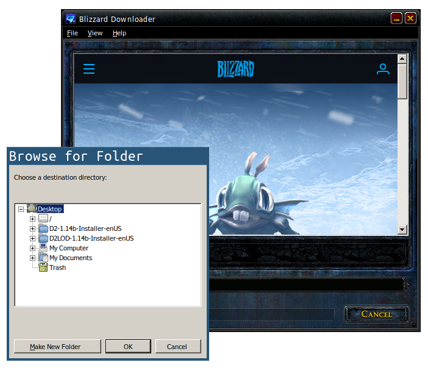
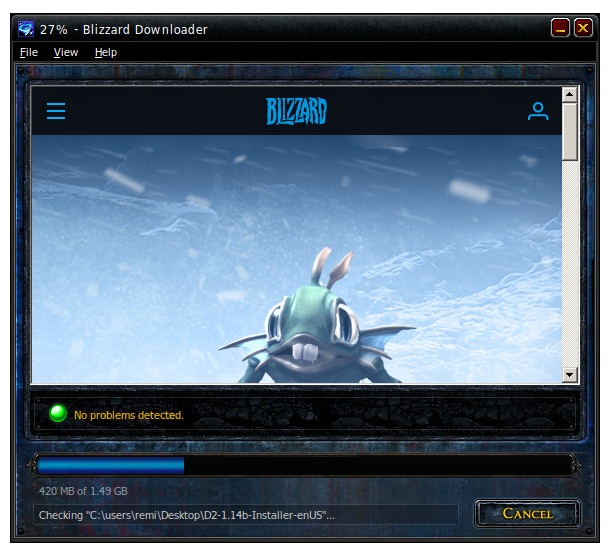
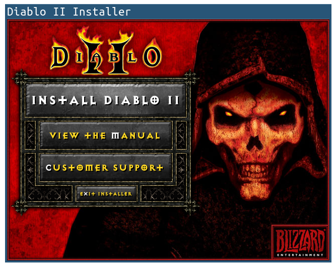
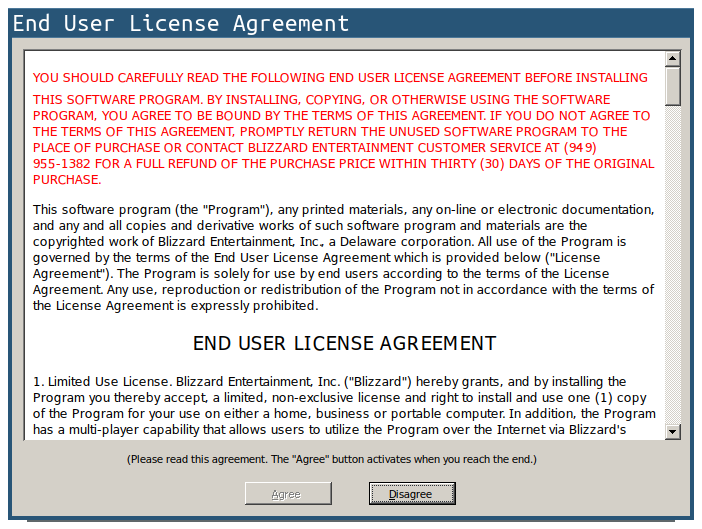
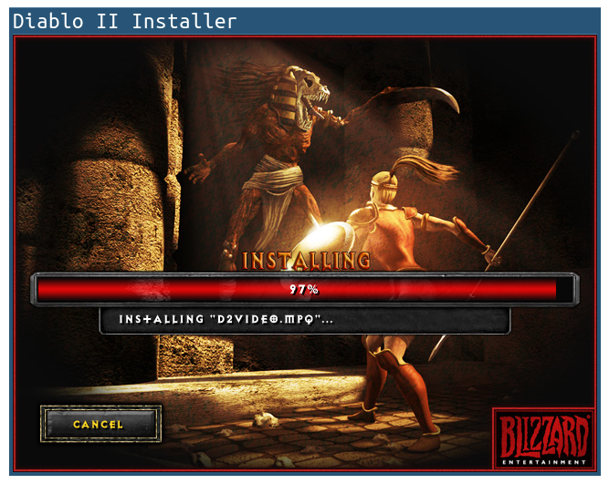
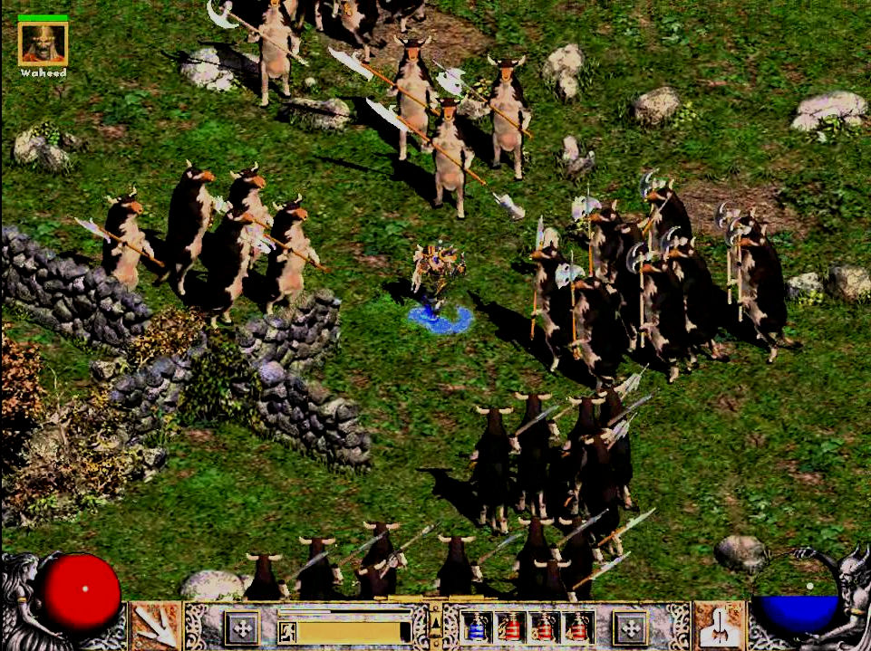

<picture>
  <source srcset="../images/diablo2-banner.webp" type="image/webp">
  <source srcset="../images/diablo2-banner.png" type="image/png">
  
</picture>

You might have heard the news: *Diablo IV* has been announced yesterday with a
[great cinematic](https://www.youtube.com/watch?v=9bRWIdOMfro). What better
time to install ~~Diablo III~~ *Diablo II* again and have some fun while
waiting for the latest iteration of the franchise?

But... it's 2019 and it is not always easy to install a game first released
back in June 2000 (yes, that's 19 years ago. Yes, you're old)! In this post I
will show you how to install *Diablo II* with its extension *Lord of
Destruction* on Windows, MacOS and Linux (Ubuntu in this case), using
[*Wine*](https://www.winehq.org) as well as optional sandboxing using
[*firejail*](https://github.com/netblue30/firejail)! Let's get to it...

If you are running *MacOS* or *Windows*, you're in luck! The official game
launcher already supports those platforms natively so you can install it and
play straight away without extra hassle! Here are the links:

* [Windows -- Diablo II](https://eu.battle.net/download/getLegacy?product=D2DV&locale=enUS&os=WIN).
* [Windows -- Lord of Destruction](https://eu.battle.net/download/getLegacy?product=D2XP&locale=enUS&os=WIN).
* [MacOS -- Diablo II](https://eu.battle.net/download/getLegacy?product=D2DV&locale=enUS&os=MAC).
* [MacOS -- Lord of Destruction](https://eu.battle.net/download/getLegacy?product=D2XP&locale=enUS&os=MAC).

## Get a License Key

First of, you will need a valid CD-Key for the game (both *Diablo II* and its
extension *LOD*). You can get them on the [official website](https://www.blizzard.com)
for about *20 euros* from Blizzard (yes, that's a shame, the game used to cost
*15.99* euros a few years ago!), or by registering your old keys if you still
have the box version (which is what I did).

## Get the Launcher

The second step is to download the Windows launcher of the game which we will
use in conjunction with Wine to make it work on Linux. You can find the links
on [Blizzard's website](https://www.blizzard.com/en-us/download/). Here they
are if you want to save some time:

* [Downloader_Diablo2_enUS.exe](https://eu.battle.net/download/getLegacy?product=D2DV&locale=enUS&os=WIN)
* [Downloader_Diablo2_Lord_of_Destruction_enUS.exe](https://eu.battle.net/download/getLegacy?product=D2XP&locale=enUS&os=WIN)

## Installing Latest Wine

You could probably use the stock version of wine which ships with your Linux
distribution but I always like to get the latest shiny version so here we go.
If you use another distribution than Ubuntu, you can *skip this section
completely*. From the [official wiki](https://wiki.winehq.org/Ubuntu):

> If your system is 64 bit, enable 32 bit architecture (if you haven't already):
> ```sh
> sudo dpkg --add-architecture i386
> ```
>
> Download and add the repository key:
> ```sh
> wget -nc https://dl.winehq.org/wine-builds/winehq.key
> sudo apt-key add winehq.key
> ```

Now you need to get the repository matching your release of Ubuntu. For me it
was `bionic` (you can get yours using command `lsb_release -cs`), but check
official instructions if that does not correspond to yours.

> ```sh
> sudo apt-add-repository 'deb https://dl.winehq.org/wine-builds/ubuntu/ bionic main'
> sudo apt install --install-recommends winehq-stable
> ```

Note that I could not install `winehq-stable` directly and had to first install
one of its dependencies manually. If you encounter an error, then try to run
the following command before installing `winehq-stable` again:

```sh
sudo apt install libasound2-plugins:i386
```

I am using **version 4.0.2** of `wine`.

## [Optional] Installing Firejail

Firejail has a special place in my heart. It allows to sandbox any program
running on Linux using kernel capabilities (some of them you might already know
from Docker world). From the [official repository](https://github.com/netblue30/firejail):

> Firejail is a SUID sandbox program that reduces the risk of security breaches
> by restricting the running environment of untrusted applications using Linux
> namespaces, seccomp-bpf and Linux capabilities. It allows a process and all
> its descendants to have their own private view of the globally shared kernel
> resources, such as the network stack, process table, mount table. Firejail
> can work in a SELinux or AppArmor environment, and it is integrated with
> Linux Control Groups.

There is an extra benefit in my opinion. You can specify a different directory
to be used as the `~/` (home) folder of each program you run in a sandbox
instead of your real home. This is great because it allows to keep files and
folders of each app nicely isolated. For example I run `thunderbird`, `cliqz`
and other programs in sandboxes and assign them different homes like
`~/.sandboxes/thunderbird`, `~/.sandboxed/cliqz`, etc. This means that I can
clean-up all files for each program by simply deleting their respective
folders! That's super convenient.

Let's get back to *Diablo II*! Install Firejail from your official Linux
repositories (or [compile it yourself](https://github.com/netblue30/firejail#compile-and-install) if that's
your thing... that's what I did). I am currently running **version 0.9.61** but I
assume this should work with other versions as well.

Firejail comes with a preset for sandboxing wine which you can find at
`/etc/firejail/wine.profile`. That's the one we will be using!

## Preparing Wine Home Folder

Let's now prepare the `wine` folder that we will use in our Firejail sandbox:

```sh
mkdir -p ~/.sandboxes/wine
```

Copy the two downloaders into `~/.sandboxes/wine/`:

* `~/.sandboxes/wine/Downloader_Diablo2_enUS.exe`
* `~/.sandboxes/wine/Downloader_Diablo2_Lord_of_Destruction_enUS.exe`

## Installing Diablo II

We can now proceed and install *Diablo II* base game:

```sh
firejail \
  --profile=/etc/firejail/wine.profile \
  --private=~/.sandboxes/wine \
  wine ~/Downloader_Diablo2_enUS.exe
```

Here are screenshots for each step of the installation process:

<figure>
  <a href="../images/diablo2-install-1.png">
    <picture>
      <source srcset="../images/diablo2-install-1.webp" type="image/webp">
      <source srcset="../images/diablo2-install-1.png" type="image/png">
      
    </picture>
  </a>
  <figcaption>Press 'OK' to select default download folder.</figcaption>
</figure>


<figure>
  <a href="../images/diablo2-install-2.png">
    <picture>
      <source srcset="../images/diablo2-install-2.webp" type="image/webp">
      <source srcset="../images/diablo2-install-2.png" type="image/png">
      
    </picture>
  </a>
  <figcaption>Enjoy the murloc view while downloading the game...</figcaption>
</figure>


<figure>
  <a href="../images/diablo2-install-3.png">
    <picture>
      <source srcset="../images/diablo2-install-3.webp" type="image/webp">
      <source srcset="../images/diablo2-install-3.png" type="image/png">
      
    </picture>
  </a>
  <figcaption>Press 'Install Diablo II'.</figcaption>
</figure>


<figure>
  <a href="../images/diablo2-install-7.png">
    <picture>
      <source srcset="../images/diablo2-install-7.webp" type="image/webp">
      <source srcset="../images/diablo2-install-7.png" type="image/png">
      
    </picture>
  </a>
  <figcaption>Accept license.</figcaption>
</figure>


<figure>
  <a href="../images/diablo2-install-6.png">
    <picture>
      <source srcset="../images/diablo2-install-6.webp" type="image/webp">
      <source srcset="../images/diablo2-install-6.png" type="image/png">
      
    </picture>
  </a>
  <figcaption>Enter you CD-Key.</figcaption>
</figure>


<figure>
  <a href="../images/diablo2-install-5.png">
    <picture>
      <source srcset="../images/diablo2-install-5.webp" type="image/webp">
      <source srcset="../images/diablo2-install-5.png" type="image/png">
      
    </picture>
  </a>
  <figcaption>Press 'OK' to select default destination directory.</figcaption>
</figure>


<figure>
  <a href="../images/diablo2-install-4.png">
    <picture>
      <source srcset="../images/diablo2-install-4.webp" type="image/webp">
      <source srcset="../images/diablo2-install-4.png" type="image/png">
      
    </picture>
  </a>
  <figcaption>It's so fast that I don't know how I managed to make a screenshot!</figcaption>
</figure>

Press **Back** then **Exit Installer**. Time to install the extension!

## Installing Lord of Destruction

```sh
firejail \
  --profile=/etc/firejail/wine.profile \
  --private=~/.sandboxes/wine \
  wine ~/Downloader_Diablo2_Lord_of_Destruction_enUS.exe
```

I will spare you all the screenshots since the procedure is identical to the
base version of the game. When you are done, resist the damning temptation and
**exit the installer**; there is one last thing we have to take care of...

## Install Latest Patch

Before starting the game and finally start playing, you will want to install
the latest patch for Diablo II: **1.14d**. Usually it can be done by accessing
Battle.net in-game but for some reason it failed in my case because of a corrupted
file... Luckily, it's possible to download and install the update manually. Get
it from the following link:

* [LODPatch_114d.exe](http://ftp.blizzard.com/pub/diablo2exp/patches/PC/LODPatch_114d.exe)

Copy it into your `wine` home folder: `~/.sandboxes/wine/LODPatch_114d.exe`.
Then start the update with:

```sh
firejail \
  --profile=/etc/firejail/wine.profile \
  --private=~/.sandboxes/wine \
  wine ~/LODPatch_114d.exe
```

## Let's Play!

Finally, to launch the game you can use the following command:

```sh
firejail \
  --profile=/etc/firejail/wine.profile \
  --private=~/.sandboxes/wine \
  wine ~/.wine/drive_c/Program\ Files\ \(x86\)/Diablo\ II/Diablo\ II.exe
```

Have fun!

<figure>
  <a href="../images/diablo2-cows.jpg">
    <picture>
      <source srcset="../images/diablo2-cows.webp" type="image/webp">
      <source srcset="../images/diablo2-cows.jpg" type="image/jpeg">
      
    </picture>
  </a>
  <figcaption>There is no such thing as the 'Cow Level'.</figcaption>
</figure>
