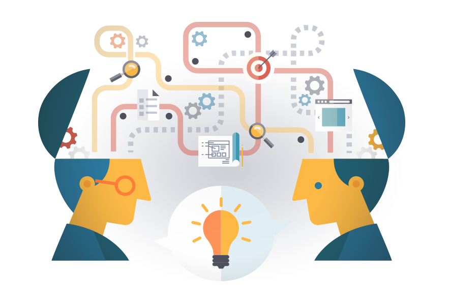
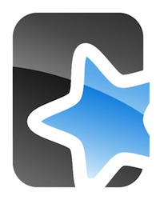
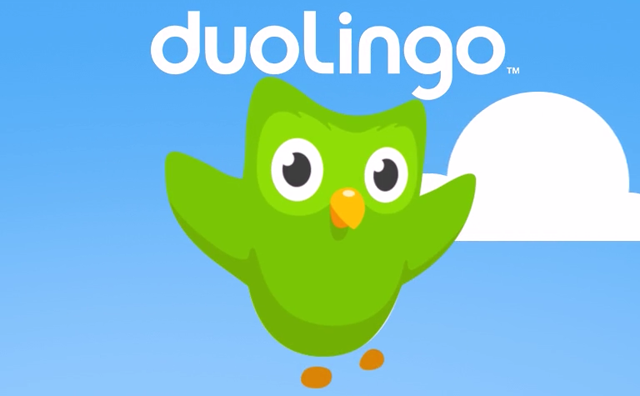
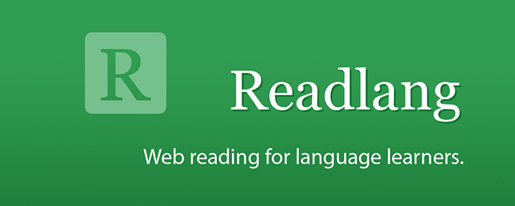

<figure>

</figure>

**Facts**:

1. I'm leaving for Germany in 2 months, for an undetermined duration.
2. I don't speak German.
3. I decided to learn it.

In this post, I intend to give a short description of the *tools and methodology I use to learn German*.
Keep in mind that this is neither a "definitive guide", nor a "how to", only some notes on what I found on my journey to learning a new language (which just began).
I would be glad to get some tricks, advices and such from the comments as well.

Here is an overview of what we will talk about in this post:

* **Duolingo**
* **Memrise**
* **Readlang**
* **Anki**
* Good will and method

# What it takes to learn a new language

*One* of the main difficulties in learning a language is **memorizing stuff**.
This is what I'll focus on in this post (and this is by no mean the only difficulty!).
You have to learn new things: news *words*, new *rules*, new *pronunciations*, *new everything*.
And it can be hard to make it stick in your head for good, especially if it's very different from what you already know.

It has been shown that it's not efficient to just learn something in one shot, by simply reading it.
*Your memories are highly organized, structured, connected*. So it's much more efficient to:

* **Create context** around something you want to remember (sounds, images, videos, mnemonics)
* **Structure your learning** (connect to existing knowledge, learn similar things in batch)
* **Review your new knowledge** at the right time, with [increasing spacing](https://en.wikipedia.org/wiki/Spaced_learning).

As it happens, there are lot of applications that can help you organize and optimize your learning.
Some are generic in the kind of knowledge you can learn, others focus on languages.
I'm mainly using the following four tools at the moment: [Anki](http://ankisrs.net/), [Memrise](https://www.memrise.com/), [Duolingo](https://www.duolingo.com/), [ReadLang](https://readlang.com) (with no particular order of importance).
In fact, I'm trying to combine multiple ways of learning, so that I can see the same stuff *several times*, with *different point of views*, *different materials* (images, sounds, etc.).
Right now, I'm only exploring the potential ways of using the tools, and I expect the way I use them will evolve over time.

# The Apps

## Anki

[Anki](https://en.wikipedia.org/wiki/Anki_%28software%29) is an application that helps you create cards, and then make you review them at the right time.
This is based on a [spaced repetition method](https://en.wikipedia.org/wiki/Spaced_repetition), that helps you review stuff just when you're about to forget it!
You can attach text, images, sound and videos to a card, so that you have context associated with each new knowledge (this helps to remember, a lot...).
I use it to create my own card to remember the new vocabulary I encounter, that I can then review later.

I also like that it provides a web interface, an Android App and a Desktop client (for GNU/Linux).
If you create an account, it's possible to synchronize your cards between devices and download decks from other people, although it's recommanded to create your own cards.

#### Pros

* Does one thing, well.
* Multi-plateform (Webapp, mobile, desktop), Anki got you covered.
* *Create your own cards*.
* Attach any content you'd like to cards.
* Sync across devices.
* Extensive [documentation](http://ankisrs.net/docs/manual.html).
* *Open-source*.
* Nothing fancy, only what is needed.

#### Cons

* Reviews feel a bit "simplistic" compared to other tools (Memrise, Duolingo).

## Memrise

[Memrise](https://www.memrise.com/) is a collaborative platform that provides the tools to make you learn almost any kind of content — although it's used a lot for languages.
People can follow "classes" on the topics they like. It's a bit like Anki, but more social, you don't have to create your own card (I know you can download decks for Anki too),
instead, you get to select topics that you want to learn, and start straight away to learn new "words". You can follow friends, compare your progress, gain "experience", etc.
The development is pretty active too, so expect to see lot of new features.

To better understand how it works, [they highlight](http://www.memrise.com/science/) that Memrise is built on three main "scientific" principles:

1. *Elaborate encoding*: Memrise helps you vividly assimilate new knowledge, promoting deep encoding and superior memory.
2. *Choreographed testing*: Testing strengthens memories in variety of ways.
3. *Scheduled reminders*: By spacing reminders, learning can be made up to x3 more efficient.

The third "fact" is one of the selling points of the app (according to me). **I like that** they offer a great variety of ways to review stuff:

* *[listening]* Write German from a German audio record
* *[listening]* Select German audio record from an English Sentence
* *[writing]* Write English translation from German sentence
* *[writing]* Write German from an English sentence
* *[selection]* Select English translation from a selection of words
* *[selection]* Select English translation from a selection of translations

#### Pros

* Makes you practice *listening* skill (from and to German) and *writing* skills in multiple ways (English to German, German to English).
* Tests diversity allows the reviews to *stay interesting and stimulating*.
* Remainders to make you *review* and *learn* new words.
* Allows you to *download* all the assets of the classes, so that you can practice *fully off-line*.

#### Cons

* *Misses the ability to make you speak* in German, and this is something Duolingo does.
* The classes are more *"basic"* and a bit less organized than in duolingo.

## Duolingo

[Duolingo](https://www.duolingo.com) is an application that helps you learn various languages.
It's a bit more structured than Memrise (as it's specifically designed to teach languages), and group knowledge by "lessons" that form a kind of *"learning unit"*.
Behind the scene, it uses more or less the same tools (or at least ideas) to help you remember your lessons:
*"Duolingo's algorithms figure out when you should practice words to get them into your long-term memory."*.
What I find interesting is that, once you master some subject for the first time, you get rewarded by a "strong" power-bar that means it's still "fresh" in your memory.
Then, as time goes, Duolingo acknowledges that the memory of this particular lesson will fade, and make you review it, just in time to make the memory stronger.

Furthermore, once you get a good mastery of a language, you can access the [Immersion](https://www.duolingo.com/translations) section of the application,
that allows you to practice your skills on translation of real content.
And I think this is part of their business model (Duolingo is free and doesn't make use of ads, it's a rare thing...).

#### Pros

* Makes you learn by *batch of coherent topics*.
* *Difficulty gradually increases*.
* Experience and progress is pretty smooth.
* Great Webapp and mobile app.
* Keep track of your progress.
* *Well-structured lessons*.

#### Cons

* Exercices could be even more diverse.
* Difficult to use with a bad connection.
* Any way to download content for off*line usage?

## ReadLang

**Edit**: As mentionned in the comments by Steve Ridout (creator of Readlang), I made a few mistakes in my description of ReadLang:

1. Firefox is supported using the [Bookmarks](http://readlang.com/webReader).
2. There is some support for mobile devices using [Chrome on android](https://readlang.uservoice.com/knowledgebase/articles/342854-is-there-a-readlang-android-app) and [Safari on iOS](https://readlang.uservoice.com/knowledgebase/articles/342855-is-there-a-readlang-ios-ipad-or-iphone-app).
3. You can export your flashcards from the web interface and import it in Anki right away, which is very nice.

[ReadLang](https://readlang.com/) is a bit different from the other tools... at first. It doesn't seem like it will help you remember stuff, instead,
it's a wonderful webapp that can assist you in the wild, while you're reading content on the Internet (blog-posts, news, etc.).
You can see him as your reading companion, always there to offer you a hand while stuck at understanding content in your target language.
It's a *WebReader*, that allows you to *click on words*, or *highlight sentences* as you read, to translate and speak the text.
It works really well, and is so discrete that you would forget it's there, if it was not for the little green icon at the top of your screen.

To be totally honest, when I told you ReadLang wasn't meant to make you remember stuff... *I lied!*
Because it automatically creates flashcards of words and sentences you translate, so that you can review them later. Like Memrise or Duolingo, it will help you review the right cards at the right time.
It also automatically extract information from online dictionaries to fill the cards, but you can edit them anyway to add even more context.
So it's pretty full of useful features. But I only started to use it a few days ago, and I'm sure I'll get to know the tool better in the next weeks/month.

There is a Free version, limited in terms of number of translations per day, but you can get away with 5 dollars per month to unleash its full power.
It's the only tool I give money for, but it's worth it. I would also like to mention that this is the work of only one man, Steve Ridout, so *kudos* to him, because Readlang can compete with applications developed by much larger teams.

The only (small) drawback is that, it's a little bit less intuitive to use on mobile devices, since there is no native application, but it's totally doable thanks to the Chrome extension and Bookmarks for Firefox and Safari.

So at the end, I really like Readlang, which offers a unique set of features. It could replace Anki for a day-to-day use, and if you ever need to review your cards offline, you can export your cards and import them in Anki seamlessly.

#### Pros

* Unique set of features, and *all batteries included*.
* *Translation* and *speaking* of sentences as you read.
* Multiple languages supported.
* You can use any online dictionary.
* *Automatic flashcard creation*.
* Flashcard export to Anki.
* Well designed.

#### Cons

* Limited support for mobile (no native application).
* <s>No support for Firefox</s>

All this tools help you to review your knowledge in some spaced repetition way.
Memrise and Duolingo are somehow *in the same niche*, and ReadLang seems to be pretty much as feature-full as Anki.
But I found their approach to be slightly different, and each tool brings its own benefits so I like to use both at the same time... for now.
In the long run, I suspect I would only need either Anki or ReadLang (or both if I can synchronize my cards between ReadLand and Anki), and maybe one of Duolingo or Memrise.

## Adding context

Context is important because it helps you make links with things you already know, hence, ease the memorization.
There are multiple ways of creating contexts, and the best is to combine them.
The more context you have, the better. Here is what I usually do when I encounter a new word, or sentence:

* Find an *image associated with the word* in some way.
* *Speak the words*, phrases (en register that in Anki)
* Instead of just associating a word in English to a German word, *use a canned sentence*.
* Do I know a word that looks or sound like the new word I'm trying to learn? Maybe, so this is good to write it down on the card too, as a *mnemonic*.

The very fact of looking for context to add to your cards... creates context by itself.
*Spending time polishing your cards is good*, and will help you remember them.
You can even improve them over time, adding more context, finding new canned sentences, etc.
It takes time, but it's worth it. You can even create several cards for the same knowledge, but with different contexts.

For example, if I were to remember the word *"Todesstern"* which means *"Death Star"*. I can create the following card:

### Front

*"Wie wir sehen, umkreist der <?> den Waldmond Endor."*

### Back

* *Speak the word death star in German*
* German Word:"Todesstern"
* English Word: "Death Star"
* Mnemonic: stern = star and in "todes" we have "des" that we can read as "death".

# What I learned so far

I'm doing my first steps in German, and I realize that the ecosystem of applications that can help you learn (and in particular, learn a new language), is rich.
There are so much tools that it's hard to know which one(s) to use.
Moreover, you often find the same features in different tools. But I think it's already a big win to use at least one tool, even if you chose it randomly,
because almost every apps selling improved memorization use the same kind of methods (spaced increasing reviews), which is *much more efficient* than a naive learning.
I hope that as I progress, I can take advantage of this tools to learn faster, better and more durably.

Furthermore, I think we shouldn't take the quest of the best tools as the goal, it's just a way to ease the learning.
Also, you should prefer being in direct contact with people speaking your target language if you can, and try to learn by speaking, which is invaluable.

To put it in a nutshell:

1. Duolingo and Memrise can help you learn the basics of the language step-by-step, starting with most common words and increasing difficulty smoothly toward more advanced topics.
2. ReadLang is a companion of choice during your day-to-day reading, it's non-obstrusive and can greatly help you improve your undestanding of the language, automatically creating flashcard for you to review later.
3. Anki is a solid choice for card edition and review, but I feel it's not at all vital if you already use Readlang. It can nonetheless be used in complement when you need to review knowledge without an internet connection or to keep track of new words if you don't have access to ReadLang for some reason.

### References

For further reading, here are some references.

#### From Memrise science page

V. A. Benassi, C. E. Overson & C. M. Hakala (Eds.) (2014). *Applying the science of learning in education: Infusing psychological science into the curriculum*. Society for the Teaching of Psychology web site: [http://teachpsych.org/ebooks/asle2014/index.php](http://teachpsych.org/ebooks/asle2014/index.php).

Bjork, R. A., Dunlosky, J. & Kornell, N. (2013). *Self-regulated learning: Beliefs, techniques, and illusions*. Annual Review of Psychology, 64, 417-444. [http://bjorklab.psych.ucla.edu/pubs/RBjork_Dunlosky_Kornell_2013.pdf](http://bjorklab.psych.ucla.edu/pubs/RBjork_Dunlosky_Kornell_2013.pdf).

Brown, P. C., Roediger, H. L., & McDaniel, M. A. (2014). *Make it stick: The science of successful learning*. Cambridge, MA: Harvard University Press.

Pashler, H., Bain, P. M., Bottge, B. A., Graesser, A., McDaniel, M. A., & Metcalfe, J. (2007). *Organizing instruction and study to improve student learning* (NCER Publication No. 2007–2004). Washington, DC: National Center for Education Research, Institute of Education Sciences, U.S. Department of Education. [http://ies.ed.gov/ncee/wwc/pdf/practice_guides/20072004.pdf](http://ies.ed.gov/ncee/wwc/pdf/practice_guides/20072004.pdf).

Potts, R. & Shanks, D. R. (2014). *The benefit of generating errors during learning*. Journal of Experimental Psychology: General, 143, 644-667. [http://discovery.ucl.ac.uk/1399515/1/RPottsLastRevision.pdf](http://discovery.ucl.ac.uk/1399515/1/RPottsLastRevision.pdf)

Roediger, H. L., Putnam, A. L., & Smith, M. A. (2011). Ten benefits of testing and their applications to educational practice. In J. Mestre & B. Ross (Eds.), Psychology of learning and motivation: Cognition in education (pp. 1-36). [http://psych.wustl.edu/memory/Roddy%20article%20PDF's/BC_Roediger%20et%20al%20(2011)_PLM.pdf](http://psych.wustl.edu/memory/Roddy%20article%20PDF's/BC_Roediger%20et%20al%20(2011)_PLM.pdf)

#### Misc posts

* [Want to Remember Everything You'll Ever Learn? Surrender to this Algorithm](http://www.wired.com/2008/04/ff-wozniak/)
* [How to Learn](https://medium.com/life-learning/how-to-learn-5c6c815051#.7hiowltv7)
* [Memrise Science](http://www.memrise.com/science)
* [12 Rules for Learning Foreign Languages in Record Time](http://fourhourworkweek.com/2014/03/21/how-to-learn-a-foreign-language-2/)

And much, much more...
