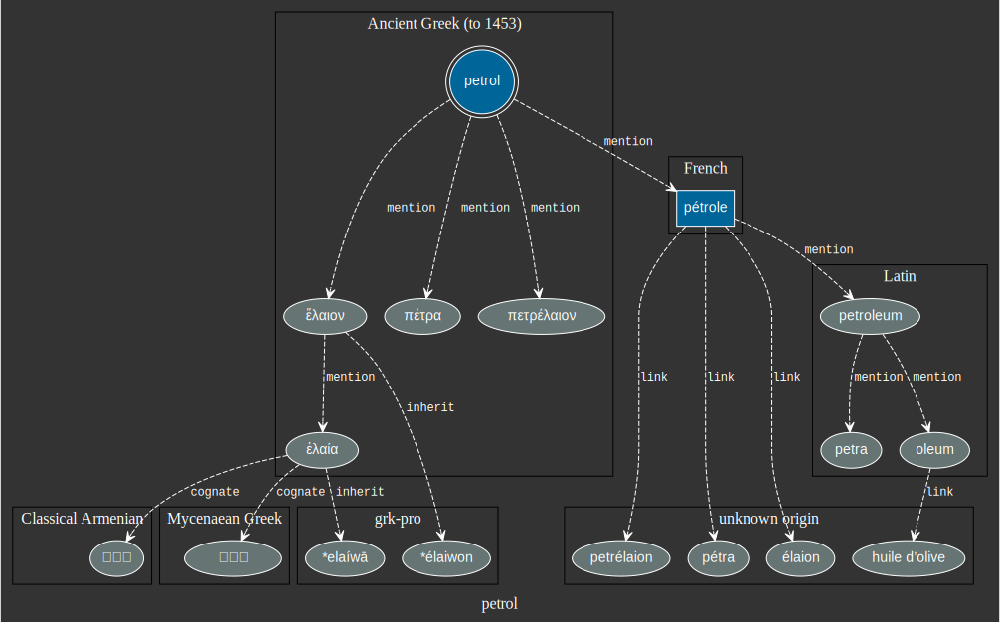
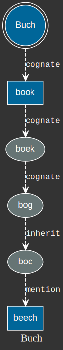

Etymology is a fascinating topic. Looking closer at the origin of words often
yields surprising and interesting connections between languages and countries,
forgotten stories or fun anecdotes. There are multiple sources for etymological
data, and most of the time, using specialized books is a safe bet. The issue is
that they are usually dedicated to one language, and it's close to impossible to
extract the data in a format which allows manipulation by programs.

There is an alternative though: [**Wiktionary**](https://www.wiktionary.org/). It is not perfect and suffers from the following drawbacks:

* Information about some words can be missing or incomplete
* Different editions offer various degrees of exhaustiveness
* It is still not trivial to extract the data in a nice format (more on that
  later)

But it offers very nice benefits as well:

* It is possible to parse the dumps (although not as easy as it could)
* It is possible to combine multiple editions to get more complete etymological data (e.g.: French and English dumps)
* It is constantly evolving and freely accessible


I often use Wiktinary from the website to get more insight about some words, but
it is not always optimal: it can be time-consuming to follow the links,
difficult to know if you missed anything, and hard to answer some questions. In
particular:

1. What is the "etymological" distance between two words, and how are they connected? (according to
   Wiktionary data)
2. Given a word in a source language (e.g.: `Buch` from *German*), what is the
   closest word in another target language (e.g.: in *English* it would be `book`.)
3. Can we identify the subset of words from a source language which is very
   closely connected to words from a target language? (e.g. by direct
   inheritance)?
4. Could we visualize the graph of etymological connections from a source *word*
   until a given *distance*?
5. etc.

In the rest of this article, I'd like to present a work-in-progress project
called [*wgraph*](https://github.com/remusao/wgraph), which I have been
developing recently. It allows to parse the content of Wiktionary dumps in
multiple languages (currently French and English are well supported and more are
on the way), to extract a graph of etymological relationships between words. Here
are a few examples of possible connections:

* German word 'Buch' *cognates* with English word 'book'
* English word 'table' *inherits* from Middle English words 'table', 'tabel',
  'tabil' and 'tabul'
* French word 'chaise' is *borrowed* from Old French 'chaiere', and *cognates*
  with English word 'chair'


## Parsing the data

The parsing stage takes as input one or multiple
[dumps](https://dumps.wikimedia.org/backup-index.html), and produces a
mapping between `source` words, and multiple references as found in the
specific pages from Wiktionary, in the `etymology` section. Using
`wgraph`, this can be performed as follows:

```sh
$ parse enwiki-articles/enwiktionary-latest-pages-articles.xml
```

(Note that you can input a compressed version of the dumps as well, either in
`.gz` or `.bz2` format)

This will produce a file named `graph.tsv` containing one word per line,
alongside its references. The first few lines look like:

```sh
lire  lira|etyl|  lira|borrowed|it  *lekʷs-|mention|ine-pro  lies|cognate|nl ...
encyclopédie  encyclique|lien|  encyclopaedia|etyl|  encyclopaedia|mention|la ...
manga  漫|mention|ltc  manga|mention|pt  漫画|borrowed|ja  man + -ga|suffix|zza ...
```

Each line starts with the word (e.g.: `manga`) and then follows a tab-separated
list of references. Each reference is a tuple of `word`, `kind` (kind of
relationship with the origin word, e.g.: borrowed from, inherited from, etc.)
and `origin` (optional, since not all origins are specified in the data).

And this is all we need start exploring the data and answer interesting
questions!

## Etymological summary visualization

Once we have a graph of "etymological" connections between words, one of the
simplest things we can do is to visualize the neighborhood of a given word. This
can be performed using the `summary` command provided by `wgraph`:

```sh
$ summary graph.tsv Buch
Graph written into: wgraph_Buch
```

<figure>
<a href="../images/wgraph_Buch_1.svg">

</a>
<figcaption>Etymological neighborhood of *Buch*</figcaption>
</figure>

We can also look deeper in the graph:
```sh
$ summary graph.tsv candidate --max-depth 2
Graph written into: wgraph_Buch
```

<figure>
<a href="../images/wgraph_candidate.svg">

</a>
<figcaption>Etymological neighborhood of *candidate*</figcaption>
</figure>

Interestingly enough, the 'candidates' referred to
the "Roman candidates wearing bleached white togas
as a symbol of purity at a public forum" (source:
[Wiktionary](https://en.wiktionary.org/wiki/candidate#Etymology)). This
explains why the word 'candidate' is related to 'white', 'candide',
'blank' and even the 'elves'.

Note that by default, up to 50 words will be included in the graph, to not
overload it too much.

It is also possible to group the nodes by origin using the `--group-by-origin`
argument:
```sh
$ summary graph.tsv petrol --max-depth 2 --group-by-origin
Graph written into: wgraph_Buch
```

<figure>
<a href="../images/wgraph_petrol_2_groupped.svg">

</a>
<figcaption>Etymological neighborhood of *petrol*</figcaption>
</figure>

Now we know that *pretrol* literally means "oil from stones": *ol* + *petra*
(the stone).


As a last example, let's explore the neighborhood of 'truie' a French word used
to designate the female of the pork. This word has a curious origin...

```sh
$ summary graph.tsv truie --max-depth 2 --group-by-origin
Graph written into: wgraph_Buch
```

<figure>
<a href="../images/wgraph_truie.svg">

</a>
<figcaption>Etymological neighborhood of *truie*</figcaption>
</figure>

You can see mentions of the word "Troja", the famous city, where the
"Trojan Horse" was used as a subterfuge that the Greeks used to enter
the city of Troy during the war. And this is where we think this 'truie'
comes from. The "Trojan Horse" gave its name to a way to prepare (or
grill) the pork called: "Porka de Troja", and they 'truie' in French.


## Distance between two words

Another simple application of the graph is to compute the size of
the shortest path between two words. This can be achieved using the
`distance` command provided by `wgraph`:


<figure>
<a href="../images/wgraph_distance_Buch_beech.svg">

</a>
<figcaption>Etymological distance between *Buch* and *beech*</figcaption>
</figure>

```sh
$ distance graph.tsv Buch book
Distance: 1
Start: Buch
> Cognates with book (English)
```

```sh
$ distance graph.tsv Buch beech
Distance: 5
Start: Buch
> Cognates with book (English)
> Cognates with boek (Dutch)
> Cognates with bog (Danish)
> Inherited from boc (Old Irish (to 900))
> Mention beech (English)
```

```sh
$ distance graph.tsv camaraderie chambre
Distance: 3
Start: camaraderie
> Mention comrade (English)
> Mention chamber (English)
> Inherited from chambre (Middle English (1100-1500))
```

```sh
$ distance graph.tsv camarade chambre
Distance: 2
Start: camarade
> None chambrée (French)
> None chambre (French)
```

You probably noticed that `origin` or `kind` are not always available. This is
mainly caused by:
1. Data in French dumps are not formatted in an easily parsable format, and most
   information needs to be extracted from links (e.g.: `''[[word]]''''`) as well
   as the context, and the parser from `wgraph` is not yet smart enough to do
   this in a lot of cases.
2. Sometimes the information is not available at all.

Also note that this command only finds *one possible path*, but it happens
that multiple paths of the same length link two words of the graph. A possible
improvement would be to find all possible paths between two words, which would
probably gives some nice insight! (It could also be visualized as a graph!)

## Closest word in a target language

Let's say you are learning a new language (e.g.: German) and while learning a
new word, you are looking for a way to "connect" it to some words you already
know. One way we could leverage our graph of words is to find a close word in a
language you already know! This is what the command `closest` is doing:

```sh
$ closest graph.tsv buchstabieren en
Start: buchstabieren
> None Buchstabe (unknown origin)
> Mention bookstaff (English)
```

The German word "buchstabieren" (or "to spell" in English) literally
means "to stab the letters on the Buch/book/beech". The connection with
"beech" comes from the fact that people used to use "beech" tree as a
material to create the tablets to write.

```sh
$ closest graph.tsv hospital fr
Start: hospital
> Cognates with hôpital (French)
```

This one was pretty easy...

```sh
$ closest graph.tsv therme en
Start: therme
> Etymology θερμός (unknown origin)
> Cognates with wearm (Old English (ca. 450-1100))
> Cognates with formus (Latin)
> Cognates with warm (English)
```

Interesting to know that "therme" (name given to the ancient Roman baths)
connects to "warm" in English (very indirectly, but we find this idea of "warm
water").

```sh
$ closest graph.tsv schön en
Start: schön
> None sheen (unknown origin)
> Cognates with show (English)
```

```sh
$ closest graph.tsv Welt fr
Start: Welt
> Inherited from weralt (Old High German (ca. 750-1050))
> Mention world (English)
> Cognates with verd (Norwegian Nynorsk)
> Cognates with vert (French)
```

Some connections are pretty far-fetched, and we would need to dig in the
original data to understand why! And this is where it can get exciting to do
some manual research!

## What are the easiest words to learn in a language?

As a final application, and as a result of our ability to compute the minimum
distance between two words in different languages, we can try to identify the
easiest sub-set of a language you can learn! This works as follows:

1. Specify the target language (e.g.: German)
2. Specify languages you already know (e.g.: French and English)

Then the `easiest` command will try to find a set of German words which
is very close from words in either English or French. These words should
be easier to memorize because they will probably resemble words you
already know.

```sh
$ easiest graph.tsv
========================================
> 1
========================================
  * personell
  * Republik
  * munizipal
  * Provokateur
  * Strauß
  * Beispiel
  * Tupperware
  * Karosserie
  * maritim
  * hypoallergen
  * Etappe
  * Finanzier
  * Pansen
  * bekommen
  * Feuer
  * blockieren
  * robbe
  * kidnappen
  * Flakon
  * lukrativ
  * eskortieren
  * universell
  * Bravour
  * Mittwoch
  * grotesk
  * jetzt
  * positiv
  ...
```

At the moment it is not possible to specify other languages than French, English
and German, but it will probably be in the future.

## Closing remarks

There is probably much more we can do using this data, and this is only
the beginning, I already find the project useful to get insight about
the origin of some words, but it is still rough around the edges. In the
following weeks I intend to improve `wgraph` in the following ways:

1. Improve information extraction from Wiktionary dumps (especially for the
   French edition), this should have a direct impact on the results of all
   sub-commands presented above.
2. Support more editions to make the dataset more complete (German is next)
3. Find more interesting applications and visualizations ideas!
